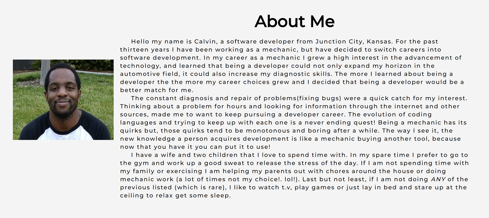

# Calvin's portfolio site. 
## Made with Vanilla JavaScript, HTML, and CSS.

You can view my site [here](https://calvinalee2006.github.io/Codecademy-Portfolio-Page/ "Portfolio Page")

## Summary
This is my portfolio page to become a software developer. A lot of youtube, research and hours went into this project. It may not look like much to the naked eye but I am proud of my simple project. My biggest challenge was using Javascript to make pop-up boxes for the first time. With this I know I am on my way to becoming a developer. 

### Author 
Calvin Anthony Lee Jr. - Full Stack Developer 
[Linkdin](https://www.linkedin.com/in/calvin-lee-90082006/)
